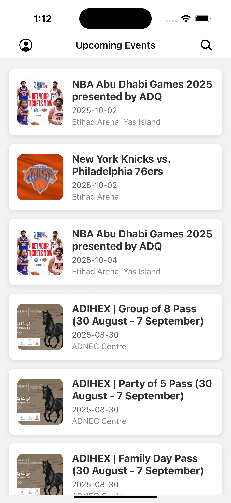
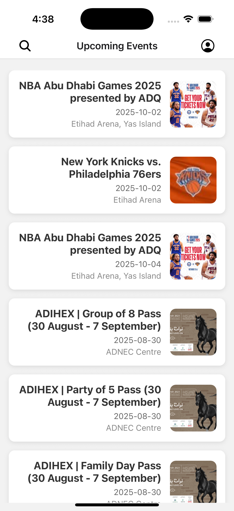

# CityPulse - React Native Expo App

CityPulse is a React Native mobile application built with Expo. The app allows users to explore local events, view event details with maps, manage favorites, and handle user authentication with login and registration.

---

## **Features**

### 1. Splash Screen

- Displays the app logo on launch.
- Handles RTL support for Arabic language.
- Automatically navigates to the login screen after a brief delay.

### 2. Authentication

- **Login Screen:** Users can log in with their credentials.
- **Register Screen:** Users can create a new account.
- Input validation and proper error handling included.

### 3. Home Screen

- Displays a list of local events.
- Search bar to filter events by name.

### 4. Event Details

- Displays detailed information about an event.
- Map view integration to show event location.
- Favorite option to mark/unmark events.

### 5. Profile Screen

- Displays user profile information.
- Favorite events list to quickly access saved events.
- Logout option to sign out of the app.

---

## **Tech Stack**

- **Framework:** React Native with Expo
- **Navigation:** Expo Router
- **State Management:** React Hooks
- **Localization:** i18n for multi-language support
- **Map Integration:** React Native Maps
- **Storage:** SecureStorage & AsyncStorage used for storing user details, preferences and favorites

---

## **Configuration**

Before running the app, you need to set your **API key** for the event service:

1. Open the file `services/eventService.js`.
2. Replace the placeholder `YOUR_API_KEY_HERE` with your actual API key:

```javascript
const API_KEY = "YOUR_ACTUAL_API_KEY";
```

---

## **Installation**

1. Clone the repository:

````bash
git clone https://github.com/abducbk/CityPulse.git


2. Install dependencies and Start the app:

```bash
cd cityPulse
npx expo start

````

## **Folder Structure**

CityPulse/
│
├─ assets/ # Images, fonts, icons
├─ components/ # Reusable UI components
├─ constants/ # Colors, strings, and static data
├─ localization/ # i18n files for multiple languages
├─ screens/ # All app screens (Splash, Login, Home, Profile, EventDetail)
├─ common/ # Hooks, services
└─ package.json

## **Usage**

Launch the app → Splash screen will appear.
Login or Register a new account.
Browse events on the Home screen or search for specific events.
Tap on an event to see its details, location on map, and favorite option.
Access your profile to see favorites and logout.

## **Screenshots**

### Spalsh Screen


### Login Screen


### Register Screen


### Home Screen





### Event Details


### Profile


## **RTL Support**

The app automatically adjusts layout for Arabic language.
All screens, including text inputs and labels, support Right-to-Left direction.
I18nManager is used to handle RTL and app reloads when language changes.
